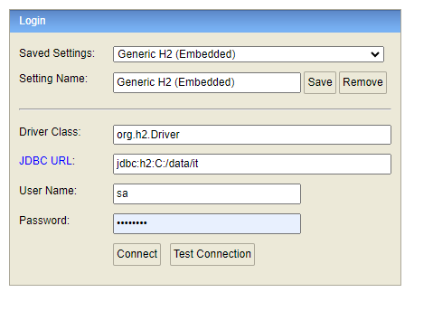

# CHALLENGE - FACTOR IT
Java - Spring Boot (Proyecto: API REST)
E- COMMERCE 🚀
## ESTADO: SIN FINALIZAR.-

## Desarrollado por 🖥️  [AndresRodriguez](https://www.linkedin.com/in/andres-rodriguez-60a166208/) - [GitHub](https://github.com/AndrRod) - [PortFolio](https://andresporfolio.herokuapp.com/)

### **Contexto general**
 diseñar y desarrollar una plataforma de E-Commerce.

### **HERRAMIENTAS**
- jAVA 
- SPRING BOOT
- SPRING DATA - HIBERNATE
- Model Mapper (para evitar mappear manualmente objetos);
- Configuracion de carga de mensajes localizados desde archivo properties (MessageResource)
### **BASE DE DATOS**
- Para pruebas se uso la base de datos h2
- Conforme la configuracion (application.properties):
 1° se debe acceder a la ruta: http://localhost:8080/h2-console
 2° Rellenar los campos conforme a la configuracion
 
 3° Los datos son guardados en carpeta: C:\data (archivo it).
 Observacion: si su pc no posee la ruta c:\ debe modificarla en el archivo properties.
### **OBJETIVO**

Los servicios a desarrollar estarán basados en 2 grandes puntos del mundo eCommerce, por un lado
las compras y por el otro el Checkout (gestión del Carrito de compras).
- Compras realizadas (GET): El servicio deberá brindar el detalle de las compras realizadas
por un usuario en particular (identificado por dni).
- Filtros: se podrá filtrar por un período (From-To). Si se le envía solo Fecha-From, el
servicio deberá devolver todas las compras a partir de la fecha indicada.
o Ordenamiento: El servicio podrá ser solicitado según 2 tipos de orden: fechas y
montos.
- Gestión del Carrito: Se deberán contemplar las acciones para poder llevar adelante el uso
de un carrito de compras, como ser:
1- Crear y eliminar un carrito.
2- Agregar y eliminar productos de un carrito.
3- Consultar el estado de un carrito. Esta acción devolverá el total de productos que
contiene.
5- Finalización de un carrito por compra. Esta acción cerrará el carrito, dando el valor
final del mismo (con promociones aplicadas si correspondiesen)

### **REGLAS DE NEGOCIO**
- Existen dos tipos de carritos, común y especial. Este hecho se determinará con un flag sobre el
  servicio de creación del carrito (isSpecial:true) además de acompañarse la fecha de creación del
  mismo.
- El cliente puede realizar varias compras en el mismo día.
- No es necesario desarrollar ningún tipo de ABM de los productos, ni de clientes. Los productos
  enviados al agregarse al carrito se tomarán como “válidos” y el precio indicado será el que se tome
  como válido (además no se tiene en cuenta stocks de los mismos, así que no hace falta que realices
  control de este punto).
